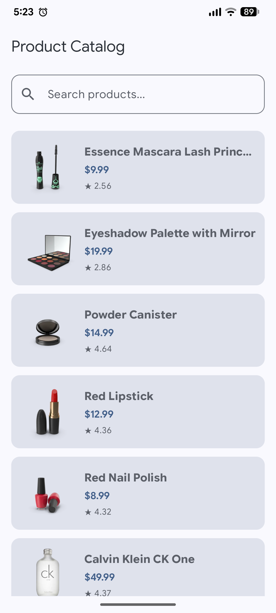
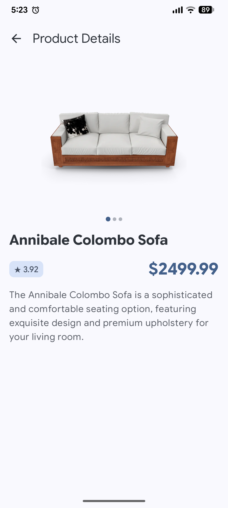
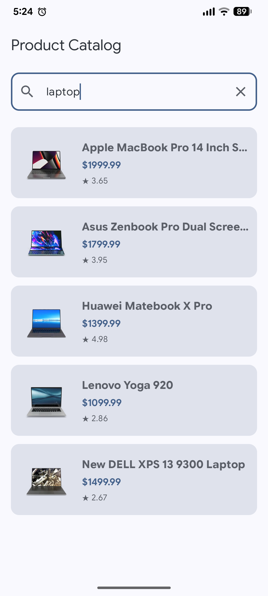

# Product Catalog App

Technical assessment submission for the Junior Mobile Developer role at Neurogine. Built with Kotlin and Jetpack Compose, consuming the DummyJSON Products API.

## Screenshots

| Product List | Product Detail | Search |
| :---: | :---: | :---: |
|  |  |  |

## Tech Stack
- **Language:** Kotlin 2.2.10
- **UI:** Jetpack Compose, Material 3
- **Networking:** Retrofit 2.11.0, OkHttp 4.12.0
- **Serialization:** Kotlinx Serialization JSON 1.7.3
- **Image Loading:** Coil Compose 2.7.0
- **Navigation:** Navigation Compose 2.8.8
- **Concurrency & State:** Kotlin Coroutines & Flow (`StateFlow`)
- **Testing:** JUnit 4.13.2, Kotlinx Coroutines Test 1.9.0

## Architecture
The application uses a 2-layer MVVM separation (`data` and `ui`):

```
com.neurogine.catalog
├── data
│   ├── model        # Serializable data classes (Product, ProductResponse)
│   ├── remote       # Retrofit interface (DummyJsonApi) and ApiClient
│   └── repository   # ProductRepository interface & ProductRepositoryImpl
└── ui
    ├── components   # Reusable UI elements (ProductCard, ProductSearchBar, StateViews)
    ├── navigation   # AppNavHost routing with typed navigation arguments
    ├── screens
    │   ├── detail   # ProductDetailScreen, ViewModel, Factory, and UiState
    │   └── list     # ProductListScreen, ProductListViewModel, and UiState
    └── theme        # Material 3 color schemes, typography, and theme wrapper
```

### Dependency Injection
Manual dependency injection is used across the codebase via constructor default parameters and a `ViewModelProvider.Factory` for `ProductDetailViewModel`. For a project of this scope, avoiding Hilt or Dagger eliminates annotation processing overhead, keeps build times low, and ensures dependencies remain explicit and straightforward to trace.

### Search Implementation Decision
Search is performed server-side via `/products/search?q=` using a 400ms debounce (`debounce(400L)`) and `distinctUntilChanged()` pipeline on the search query flow.

Server-side searching was chosen over in-memory list filtering because:
- Client-side filtering only operates on whatever subset of items has already been fetched into memory (e.g., the first 20 items).
- Querying the remote endpoint ensures the full remote catalog is searchable and avoids pagination index desynchronization when clearing or updating search terms.

## How to Run

### Prerequisites
- JDK 17 or higher
- Android SDK (minSdk 24, targetSdk 37)

### CLI Commands
Compile and build the debug APK:
```bash
./gradlew assembleDebug
```

Run unit tests:
```bash
./gradlew testDebugUnitTest
```

Run full test suite:
```bash
./gradlew test
```

## AI Usage Disclosure
Per assessment guidelines, AI was utilized for:
- Suggesting conventional commit message formats.
- Pre-push code formatting and cleanup checks.
- Scaffolding the initial README outline.

Core business logic, state handling, error recovery, repository contracts, and architectural decisions were written and verified directly.

## TODOs & Trade-offs
To stay within the 2–3 hour assessment timebox, several features were intentionally deferred:
- **Offline Caching:** A persistent Room database layer for offline caching and read-through syncing was omitted; data is held in-memory within ViewModel state flows.
- **Shared Element Transitions:** Navigation transitions between list thumbnails and detail hero images use standard Compose slide/fade transitions rather than shared element bounds.
- **Paging 3 Integration:** A lightweight manual pagination system observing `LazyListState` layout indices was used instead of AndroidX Paging 3 to keep pagination logic transparent and free of extra library abstractions.
